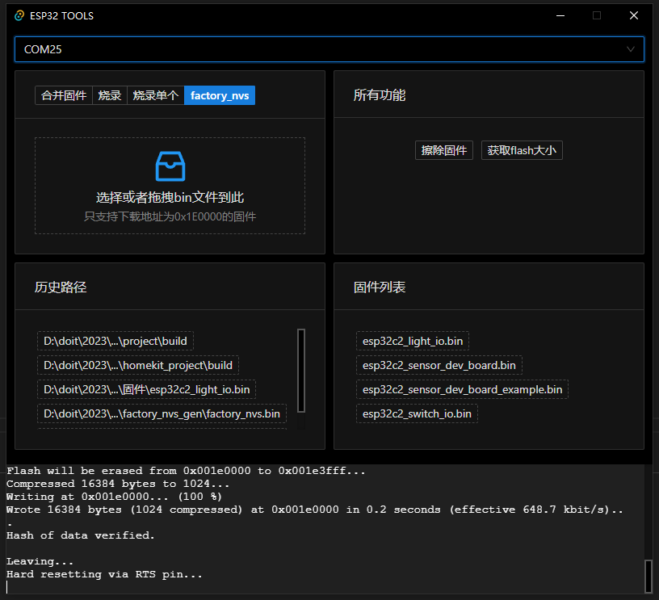

# ESP32 TOOLS

方便自己使用

* 所有功能 支持[JSON](/src-tauri/tools.config.json)进行动态配置✅

自带工具如下，可以参考如下配置进行扩展
``` json
{
	"toolListConfig": [
		{
			"name": "合并固件",
			"value": "mergeBin",
			"toast": null,
			"dropDesc": "选择或者拖拽build目录到此",
			"dropHelp": "请在执行idf.py build后再使用",
			"dropRegex": "(build)$",
			"cmd": [
				"--chip",
				"${chip}",
				"merge_bin",
				"-o",
				"${appName}",
				"${flashArgs}"
			]
		},
		{
			"name": "烧录",
			"value": "flash",
			"toast": "烧录未合并的固件",
			"dropDesc": "选择或者拖拽build目录到此",
			"dropHelp": "请在执行idf.py build后再使用",
			"dropRegex": "(build)$",
			"cmd": [
				"--chip",
				"${chip}",
				"-p",
				"${port}",
				"-b",
				"1152000",
				"--before=default_reset",
				"--after=hard_reset",
				"write_flash",
				"${flashArgs}"
			]
		},
		{
			"name": "烧录单个",
			"value": "flashSingle",
			"toast": "烧录合并后的固件",
			"dropDesc": "选择或者拖拽bin文件到此",
			"dropHelp": "只支持下载地址为0x0的固件",
			"dropRegex": ".(bin)$",
			"cmd": [
				"-p",
				"${port}",
				"-b",
				"1152000",
				"write_flash",
				"0x0",
				"${path}"
			]
		}
	],
	"customToolList": [
		{
			"name": "擦除固件",
			"toast": "擦除固件",
			"cmd": [
				"-p",
				"${port}",
				"erase_flash"
			]
		},
		{
			"name": "获取flash大小",
			"toast": "获取flash大小",
			"cmd": [
				"-p",
				"${port}",
				"flash_id"
			]
		}
	]
}
```

# Some Screenshots
